<div align="center">

# ThoughtSpace

[](https://github.com/JGalego/ThoughtSpace/actions/workflows/ci.yml)


<br/>


</div>

**An AI-native medium for thinking.** ThoughtSpace is a shared workspace of persistent,
semantic, executable objects. A human and an AI manipulate the *same* objects through the
same typed protocol. You don't ask a question and read an answer. You build a small world,
poke at it, and the AI helps you modify, explain, test and abstract it.

The idea comes from Michael Nielsen's [*Magic Paper*](https://cognitivemedium.com/magic_paper),
and asks what that medium becomes when the computer understands the semantic structure of
what's on the page.

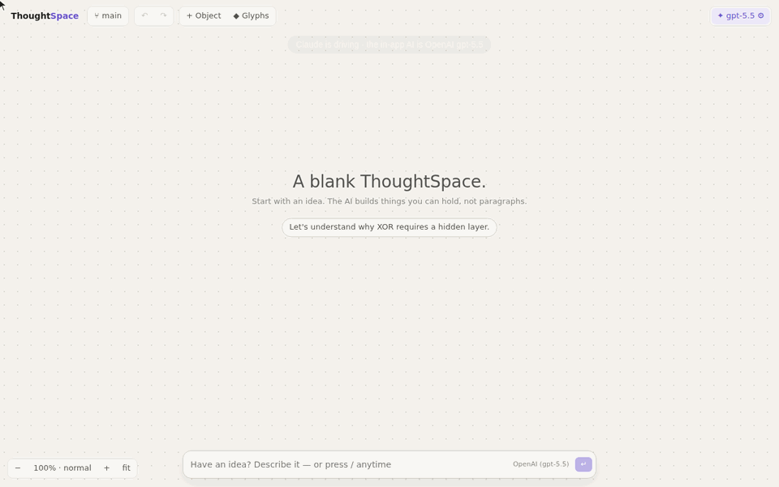

*Claude drives the UI; the in-app AI is OpenAI gpt-5.5. Waits on the model are sped up.
More use cases are in [the gallery](#see-it-in-use) below.*

It is also an **open, interactive canvas for teaching any subject**: you and the AI build
the lesson live, in front of the class, out of sliders, live formulas, simulations, random
trials, plots and predictions that an experiment can settle. See
[Teaching with ThoughtSpace](#teaching-with-thoughtspace).

The first domain it was built around is small neural networks, with one journey:
*why does XOR need a hidden layer?*

## Teaching with ThoughtSpace

A lesson in ThoughtSpace is not a slide deck or a fixed simulation. It is an **open
lesson**: a handful of generic building blocks that you, the AI and the class assemble and
change live, in any subject.

| Building block | What the class sees | What it is |
|---|---|---|
| **Variable** | a slider with a unit | a named quantity: `theta`, `R0`, `tax` |
| **Formula** | a live, typeset equation | `R = v0^2*sin(2*rad(theta))/g`, recomputed as sliders move |
| **System** | rate equations and their run | `dS/dt = -beta*S*I`, integrated over time, with a stop condition |
| **Random trials** | a histogram and statistics | `M = meanof(n, randint(1, 6))`, repeated thousands of times, seeded |
| **Plot** | a curve, time series, trajectory or histogram | drag along a curve to move its slider |
| **Prediction** | a claim, *unverified* until tested | "R is largest when theta = 45" |
| **Experiment** | a table, a chart and a verdict | vary one slider, freeze the rest, compute whether the prediction holds |
| **What if** | a branch beside the original, compared | "what if k = 0.05" |

Names link themselves: a formula that mentions `theta` is wired to the `theta` slider, and
the arrows on the canvas are the dependency graph. Everything is computed by the kernel,
deterministically, so the whole class sees the same numbers and every experiment reproduces.

**The classroom loop** is *predict → play → test → change the conditions → test again*.
Students commit to a prediction, move the sliders, test it with a controlled experiment,
then change something the prediction quietly assumed (air drag, a more contagious
disease, the slopes of a market) and watch the verdict flip.

**Three ways to start a lesson:**

1. **Ask the AI** for any topic: *"I teach chemistry. Build a lesson on radioactive decay
   and half-life my students can play with."* It builds from the same building blocks and
   leaves an untested prediction for the class. This needs a model (⚙: Claude, OpenAI or
   any OpenAI-compatible server).
2. **Type the mathematics**, even offline. `y = a*sin(b*x) + c` makes a slider for every
   unknown, the live formula and its curve. `dN/dt = r*N*(1 - N/K); N(0) = 5` makes a
   system, `X ~ randint(1,6) + randint(1,6)` makes random trials, and `a = 3` sets a
   slider. Then write a prediction in words, like *"test: y increases as c increases"*,
   *"test: R is largest when theta = 45"* or *"test: when vacc = 0.6, I_max is below
   0.01"*, and it becomes an experiment. *"what if b = 4"* branches and compares, and
   *"why"* measures which slider matters most right now.
3. **Start from an example.** The empty canvas offers five ready-made lessons (physics,
   epidemics, Fourier series, the central limit theorem, tax incidence). They are built
   from the same primitives, so they're starting points to change, not finished apps.

<table>
<tr>
<td width="50%" valign="top">

**Any subject, built live by the AI**<br/>
No template: the in-app AI (OpenAI gpt-5.5) builds a half-life lesson from the building
blocks. The class moves the sliders, and the prediction is tested by the kernel, not
asserted by the model.

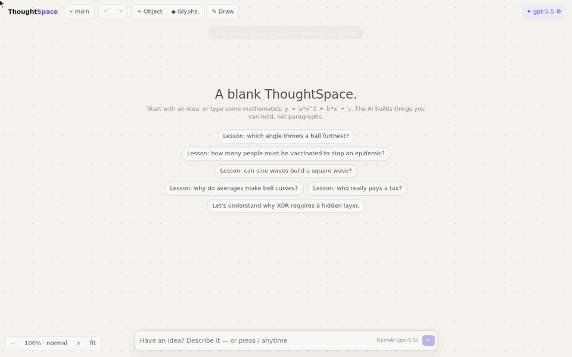

</td>
<td width="50%" valign="top">

**Type the mathematics**<br/>
`y = a*sin(b*x) + c` gets sliders, a live formula and a draggable curve. A prediction
written in words becomes an experiment, and *what if* branches and compares. This works
offline.

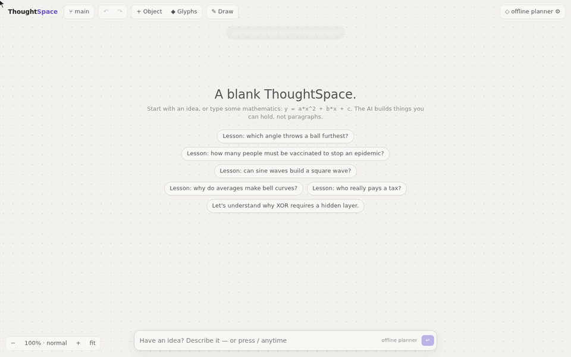

</td>
</tr>
<tr>
<td valign="top">

**Physics: which angle throws furthest?**<br/>
The range formula and a simulated flight with air drag. The class predicts 45° and an
experiment agrees. Then they turn on drag, test again, and the claim is refuted.

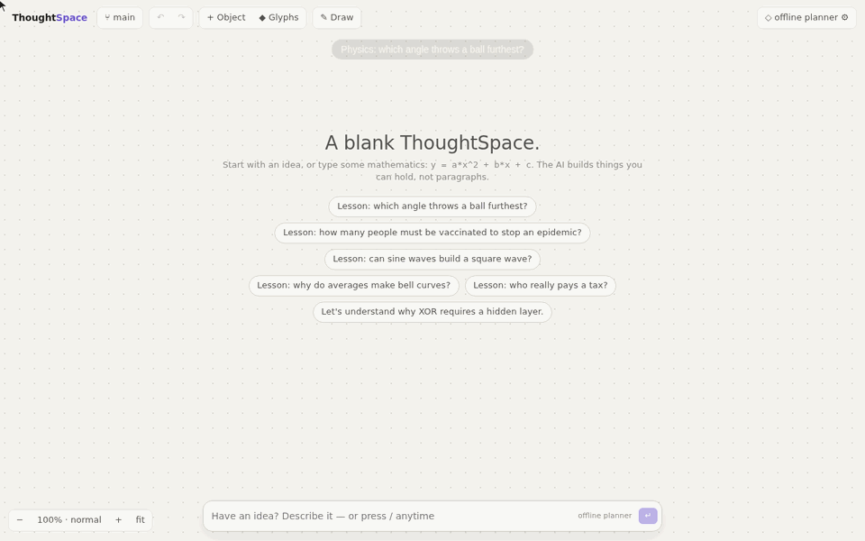

</td>
<td valign="top">

**Biology: stopping an epidemic**<br/>
An SIR model with vaccination. "60% is enough" holds for R₀ = 2.5. Raise R₀ to measles-like
levels and the same prediction fails: the herd-immunity threshold is now 83%.

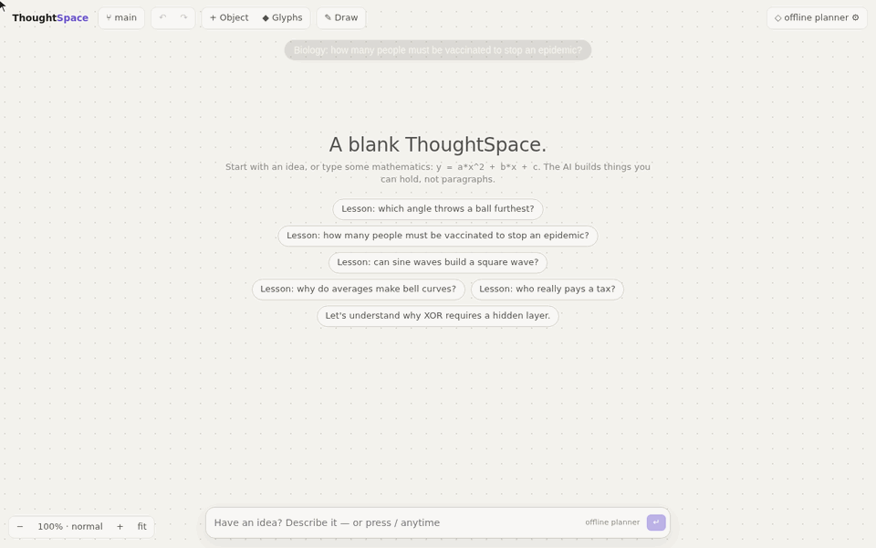

</td>
</tr>
<tr>
<td valign="top">

**Maths: square waves from sines**<br/>
Add Fourier terms and the corners sharpen, but the bump at the jump stays about 9% high.
The natural prediction that enough terms remove it is refuted: the Gibbs phenomenon.

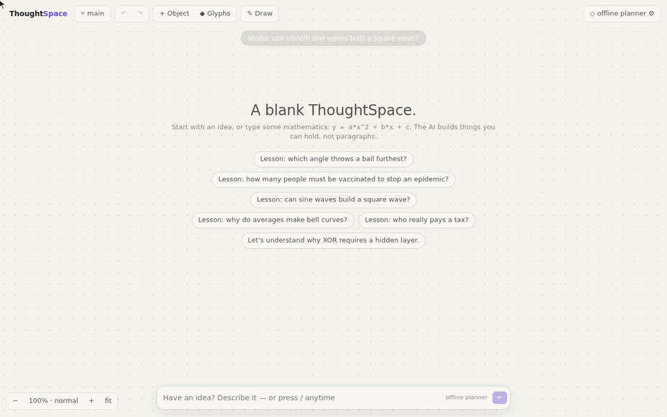

</td>
<td valign="top">

**Statistics: why averages make bell curves**<br/>
Seeded random trials of the average of n dice. Slide n and the flat distribution becomes
a bell. 🎲 draws a fresh sample, and the spread follows σ/√n.

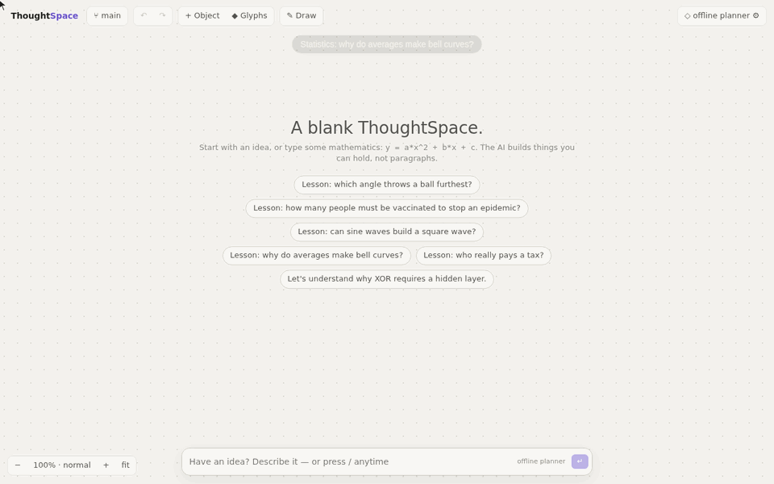

</td>
</tr>
<tr>
<td valign="top">

**Economics: who really pays a tax?**<br/>
Sellers are charged the tax, so do sellers pay it? An experiment says buyers pay half. Make
supply steeper and the less flexible side ends up paying more.

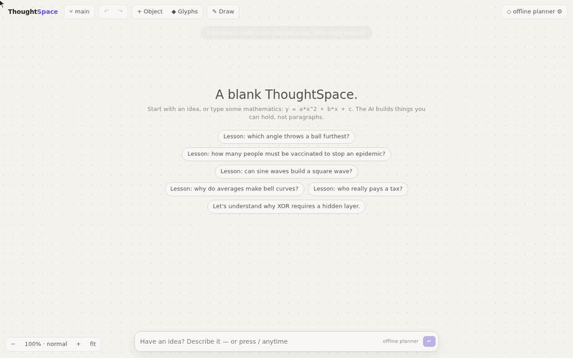

</td>
<td valign="top">

**The expression language**<br/>
`+ - * / ^`, implicit multiplication (`2x`), comparisons and `c ? a : b`; `sin cos tan exp
ln log sqrt abs min max floor round hypot clamp mod choose fact rad deg`; the constants `pi`
and `e`; `sum(k, 1, n, …)`, `prod`, `integrate(x, a, b, …)`, `diff(x, at, …)`,
`maxover/minover/argmax/argmin(x, a, b, …)`; and, for trials, `rand() randn() randint(a,b)
coin(p) randexp(rate)` with `meanof(n, …)` and `sumof(n, …)`. It is parsed and evaluated by
the kernel (no `eval`), with a step budget.

</td>
</tr>
</table>

## Run it

```bash
npm install
npm run dev            # http://localhost:5173 — works offline with the deterministic planner
ANTHROPIC_API_KEY=sk-ant-… npm run dev   # Claude participates; the key stays on the dev server
OPENAI_API_KEY=sk-… npm run dev          # an OpenAI model participates, same way
OPENAI_COMPAT_BASE_URL=https://api.groq.com/openai/v1 OPENAI_COMPAT_API_KEY=gsk_… npm run dev
                                          # any OpenAI-compatible server (Groq, Ollama, OpenRouter, …)
npm test               # kernel, protocol, journey and agent-loop tests (offline)
LIVE=1 OPENAI_MODEL=gpt-5.5 npm run test:live   # the whole journey against a real model
```

Choose the AI participant in the ⚙ menu: the offline planner, Claude, OpenAI, or any
OpenAI-compatible server. For each
provider you can use the dev server's key or paste your own, which is kept in your browser
and sent straight to that provider. You can also set the model there.

- **Claude** defaults to `claude-opus-5` with adaptive thinking. Requests enable the API's
  server-side refusal fallback (`fallbacks: "default"`), and if an account rejects that
  beta, the request is retried once without it.
- **OpenAI** defaults to `gpt-5.5` and uses the Responses API with function tools. Newer
  models reject tools combined with reasoning on Chat Completions.

- **OpenAI-compatible servers** use Chat Completions, the dialect they all speak (or the
  Responses API, if you tick that for a server that has it). There are presets for Groq,
  Ollama, OpenRouter, Together, LM Studio and vLLM; any other base URL works too.
  Requests are streamed, because slow local servers time out long non-streaming requests.
  The output-length parameter is negotiated (`max_completion_tokens`, falling back to
  `max_tokens`). `<think>` blocks from open reasoning models are stripped from replies.

Every provider gets the same system prompt, the same three tools and the same kernel.
Nothing is provider-specific below `src/agent/`.

**Local models.** Ollama's default context window is 4k tokens, and ThoughtSpace's prompt
plus workspace is bigger than that, so start Ollama with `OLLAMA_CONTEXT_LENGTH=16384`. For
direct browser access (rather than the dev-server proxy) also set `OLLAMA_ORIGINS=*`:

```bash
OLLAMA_CONTEXT_LENGTH=16384 ollama serve & ollama pull qwen3:4b
OPENAI_COMPAT_BASE_URL=http://localhost:11434/v1 OPENAI_COMPAT_MODEL=qwen3:4b npm run dev
```

## The journey

1. On the blank canvas, click **"Let's understand why XOR requires a hidden layer."**
2. The AI builds a construction rather than writing an answer. You get the XOR data, a
   single neuron fed by it, the neuron's decision boundary, its live equation, and an
   **unverified claim**.
3. **Drag an edge** of the network to change its weight, or **drag a neuron** to change
   its bias. The boundary line and the equation follow in real time. **Click a data
   point** to relabel it (turn XOR into AND and watch the same neuron succeed). Hover a
   point to see the network's activations light up.
4. **Train ▸**. Gradient descent gives up: the weights shrink to ≈0 and the network
   answers ½ everywhere (loss ln 2).
5. Select the network and ask **"Why doesn't this one work?"** The AI highlights the
   output neuron and the boundary, derives the boundary's equation from the live weights,
   and pins its explanation to the plot.
6. **"Show me the smallest change that makes it work."** The AI runs a reproducible
   experiment over hidden sizes × 6 seeds. The experiment verifies the claim, and the AI
   creates a **branch**: the network with 2 hidden units, trained, sitting beside the
   original with its assumption recorded.
7. **Compare branches** (the suggestion on the variant) to get a live side-by-side.
8. **"Turn this into a reusable XOR network glyph."** The construction folds into a
   glyph that exposes its hidden units, activation and seed. You can expand it back into
   its graph, zoom in to see inside, or place new copies from ◆ Glyphs.

Along the way you can zoom the canvas out (objects collapse to their essence) and in
(every weight and bias appears). Double-click a neuron to zoom into its equation, then
into its scalar arithmetic. Fork the whole workspace (⑂) and diff branches. Undo and redo
anything (⌘Z / ⇧⌘Z). Open the inspector to see each object's provenance, history, and
exactly what the AI sees.

## See it in use

Each of these is recorded from the running app with the deterministic offline planner as
the in-app AI, so they need no API key and can be reproduced exactly (see
[regenerating](#regenerating-the-gifs)).

<table>
<tr>
<td width="50%" valign="top">

**Experiments and claims**<br/>
The AI's claim starts *unverified*. A seeded, controlled experiment tests it (one variable,
everything else constant, six seeds). The verdict is computed, *Reproduce* re-runs every
seed and checks the results hash, and provenance shows which computation verified the
claim.

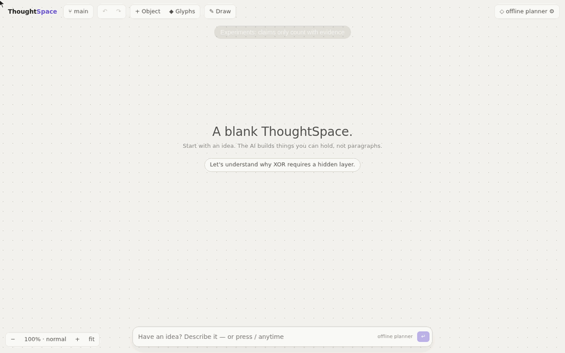

</td>
<td width="50%" valign="top">

**Branches and comparison**<br/>
"What if we used ReLU?" creates a trained variant beside the original, with its assumption
recorded, and a live side-by-side comparison. Forking the whole workspace gives a timeline
with an explicit parent, and you can diff it against `main`.

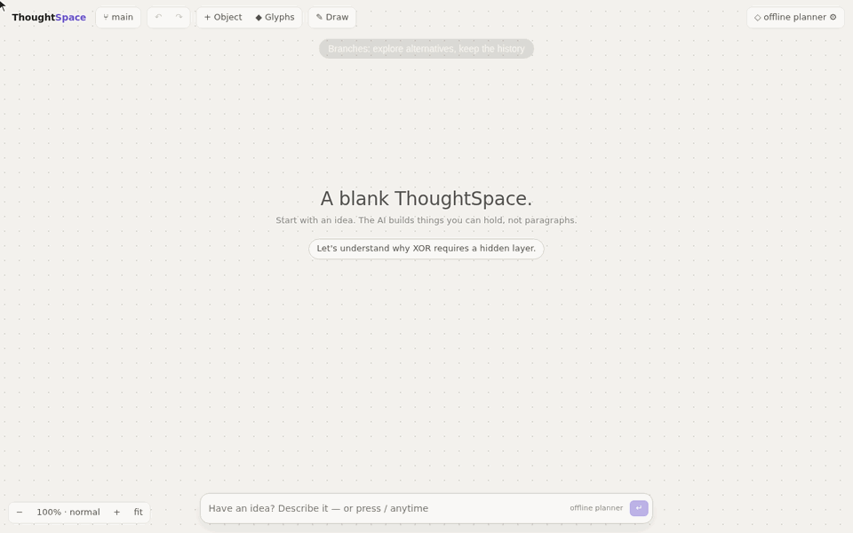

</td>
</tr>
<tr>
<td width="50%" valign="top">

**Glyphs: reusable abstraction**<br/>
The smallest working network becomes a glyph with exposed knobs and a live output. Turn a
knob, train what's inside, expand it back into its construction, and place fresh copies
from the library.

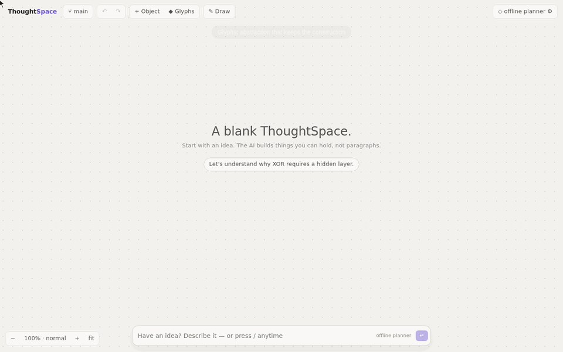

</td>
<td width="50%" valign="top">

**Semantic zoom**<br/>
Zoom out and objects collapse to their essence. Zoom in and every weight appears.
Double-click a neuron for its live equation, then zoom further to the scalar arithmetic for
one input. Change a weight and every level follows.

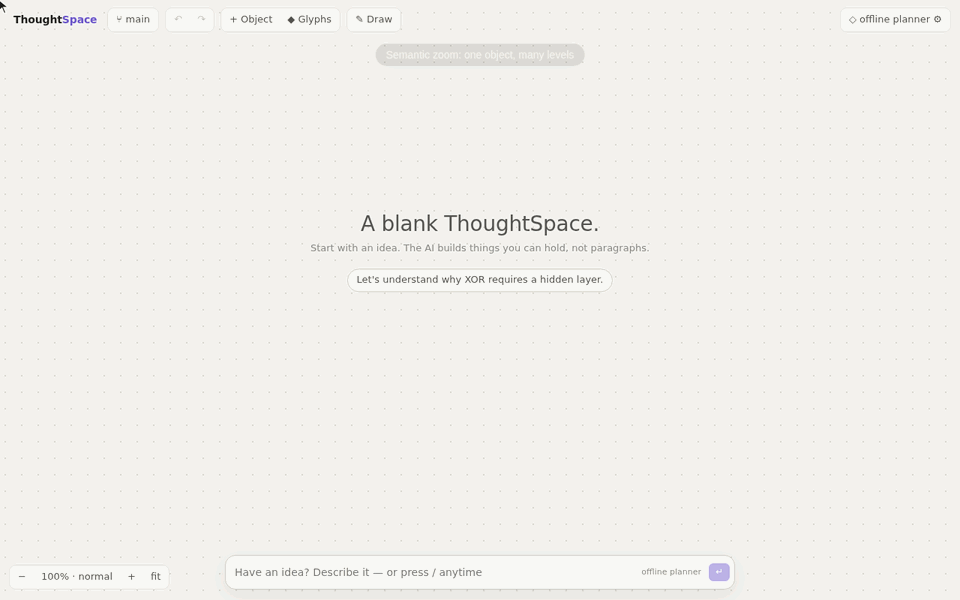

</td>
</tr>
<tr>
<td width="50%" valign="top">

**Hands on**<br/>
Hover a data point and the network lights up with its activations. Drag weights and biases,
click points to turn XOR into AND, train, scrub through training epoch by epoch, and ask
which weight is fragile.

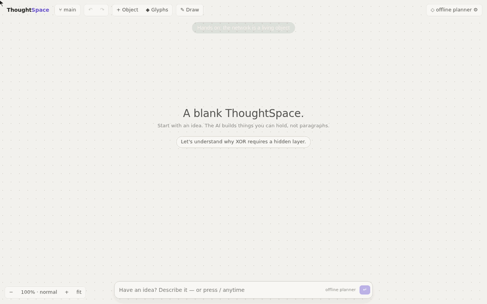

</td>
<td width="50%" valign="top">

**History and provenance**<br/>
Every change is an event. Inspect any object's parameters, provenance and history, and see
exactly what the AI sees. Every object shows whether you or the AI made it. Undo walks back
through the log, redo replays it exactly, and the branch menu keeps the whole timeline.

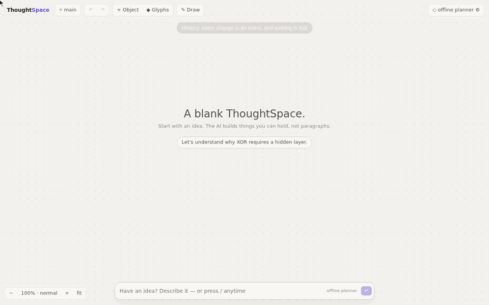

</td>
</tr>
</table>

### Regenerating the GIFs

The GIFs are scripted scenarios in `scripts/gifs/scenarios/`, recorded from the running
app by `scripts/gifs/record.mjs`. It uses Playwright with a visible cursor and captions,
and `scripts/make-gif.py`, which needs Pillow, turns the frames into a GIF with waits on the
AI sped up.

```bash
npm run dev &
node scripts/gifs/record.mjs experiments branches glyphs zoom hands-on history ink
node scripts/gifs/record.mjs lesson-physics lesson-epidemic lesson-fourier lesson-statistics lesson-economics lesson-open
MODEL=gpt-5.5 node scripts/gifs/record.mjs demo lesson-ai   # these use a real model (OPENAI_API_KEY on the dev server)
```

## Drawing

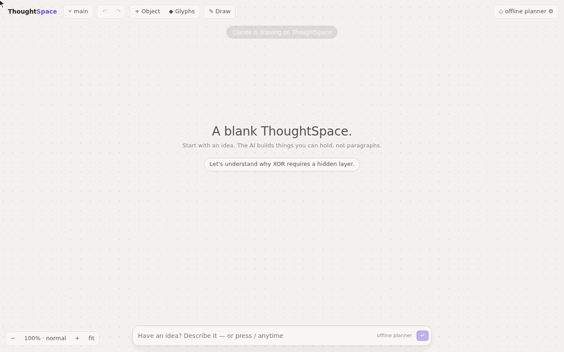

Press **P** (or ✎ Draw) and draw on the paper. Keys **1–4** pick the ink: black, orange,
blue and violet. As in *Magic Paper*, ink is a first-class object, and where it lands on
something that understands it, it becomes meaning:

| You draw | It becomes |
|---|---|
| a straight line across a single neuron's decision-boundary plot | that neuron's boundary: the weights are solved from your line and oriented to fit the data. On XOR you can feel that no line works |
| an orange or blue dot on a dataset or boundary plot | a new data point of class 1 or 0 |
| a loop around objects | a selection, so "this" is what you circled |
| anything else | ink: a `sketch` object attached to what it was drawn over. It moves with that object, can be undone and inspected, can go into a glyph, and the AI can read it ("what did I just draw on?") |

The renderer turns screen points into data coordinates; the kernel only ever receives
semantic operations (`add_point`, `set_boundary`, `draw`). The AI draws too, but with
semantic shapes (`{"op": "draw", "shape": "circle", "target": "plot_5"}`: circle,
underline, arrow, cross, check), never coordinates. The kernel computes the strokes. In the
demo above, the offline planner circles the plot it is explaining. In a live test, gpt-5.5
circled the decision-boundary plot as the reason a single neuron fails. It declined to cross
out the claim, because the claim was unverified rather than refuted.

## Architecture

```
UI (React)  ─────┐
Offline planner ─┼──►  Workspace kernel  ──►  deterministic executor
Claude agent ────┘     validate · compile      (seeded MLP training, experiments,
                       events · branches        decision grids, sensitivity)
                       undo/redo · persist
```

- `src/kernel/`: framework-independent. `types.ts` (object/relation/event model),
  `kinds.ts` (the kind registry that everything else is generated from), `ops.ts` (the
  semantic operation protocol and its validation), `kernel.ts` (event-sourced history,
  branches, undo/redo, diff), `nn.ts` + `experiment.ts` (the deterministic executor),
  `layout.ts` (semantic placement → coordinates), `suggest.ts` (contextual noticers),
  `formulas.ts` (live equations), `view.ts` (the semantic view the AI gets). The open-lesson
  kinds live in `expr.ts` (the safe expression language), `calc.ts` (evaluation along the
  dependency arrows: formulas, RK4 systems, seeded trials, sweeps) and `ops-calc.ts`
  (creating, linking, plotting and experimenting on them).
- `src/agent/`: clients of the kernel that share one host interface. `local.ts` is a
  deterministic planner for the canonical vocabulary, and `lessons.ts` gives it the
  open-lesson vocabulary (typed mathematics, predictions in words, what if, why) and the
  ready-made lessons. `shared.ts` holds what every LLM
  participant shares: the system prompt, the three tools (`apply_operations`, `inspect`,
  `highlight`), and their execution, where kernel validation errors go back to the model as
  tool errors. `claude.ts` and `openai.ts` are thin provider loops over it.
- `src/ui/`: renderers are pure projections of semantic state. There is one per kind,
  inside a generic frame.

The full design (domain model, object schema, protocol, events, rendering, execution
boundary, demo, and scope) is in [`docs/DESIGN.md`](docs/DESIGN.md).

## Testing with real models

`tests/live/journey.live.test.ts` runs the canonical journey through a real model and logs
every batch the model submitted and every rejection. The first runs against OpenAI models
(gpt-4.1, gpt-5.4-mini, gpt-5.5) exposed real problems, which are now fixed:

- **Responses API:** newer models refuse function tools with reasoning on Chat Completions.
- **Evidence bug:** an experiment with no testable expectations was counted as refuting a
  claim. Such experiments are now *inconclusive* and can't verify anything. Expectations
  can also compare two variants (`"than"`).
- **Friction:** models wrote refs without `$`, reused refs across batches, and used
  placement and metric synonyms. The protocol now accepts these unambiguous forms, and refs
  live for a whole agent turn. That took gpt-4.1 from failing the journey to 0 rejected
  batches.

`tests/live/lessons.live.test.ts` asks a real model to build lessons in subjects it has no
template for, and then to test a class's prediction. gpt-5.5 passes all four: radioactive
decay, the pendulum (where it measured √2, not 2, for doubling the length), simple vs
compound interest, and foxes and rabbits (Lotka–Volterra). Every first batch had been
rejected only because the model invented a placement key for its opening note. Placement
is only a layout hint, so the kernel now falls back to automatic layout and says so in the
result.

Any OpenAI-compatible server can run it too:

```bash
LIVE=1 LIVE_BASE_URL=http://localhost:11434/v1 LIVE_MODEL=qwen2.5:7b npm run test:live
```

Latest results (the full five-step journey, pass/fail as asserted by the test):

| Model | Path | Result |
|---|---|---|
| gpt-5.5 | OpenAI Responses | passes |
| gpt-5.4-mini | OpenAI Responses; Chat Completions (streamed) | passes both ways |
| gpt-4.1 | OpenAI Responses | passes |
| gpt-4.1 | Chat Completions | tool calls work; sometimes stops before training its fix to 100% (it reports the shortfall honestly) |
| qwen3:4b | Ollama, CPU | works, but thinks for thousands of tokens per turn: far too slow on 4 CPU cores. Ollama's OpenAI endpoint can't switch its thinking off |
| qwen2.5:3b | Ollama, CPU | the connection works end to end (tool call → kernel → reply), but the model is too small to build the construction |
| qwen2.5:7b | Ollama, CPU | 5½ minutes for the first turn, then an empty reply |

Against Ollama, streamed tool calls, the kernel round trip and the dev-server proxy all
work. What's missing locally is model capability and speed: on CPU, use the largest
tool-capable model you can run, or a hosted OpenAI-compatible server such as Groq.

## Continuous integration

`.github/workflows/ci.yml` typechecks, runs the offline test suite and builds on every push
and pull request. Starting the workflow by hand with **live** enabled also runs the
canonical journey against an OpenAI model, using the repository's `OPENAI_API_KEY` secret
if it is set.

## Principles the code enforces

- **The LLM is never the source of truth.** It submits typed operations. The kernel
  validates each batch atomically and rejects coordinates from the AI.
- **No numbers from the model.** Training, metrics, experiment verdicts and equations
  come from the seeded executor. Results are stored in events, so replay never recomputes
  them.
- **Claims don't silently become facts.** A claim's status changes only through
  `verify_claim` with an experiment as evidence.
- **Abstraction preserves construction.** A glyph keeps its members, relations and a
  frozen definition.
- **Branches are relationships, not copies.** A variant carries `branched_from` and its
  assumption. A workspace fork carries its parent and fork point.
